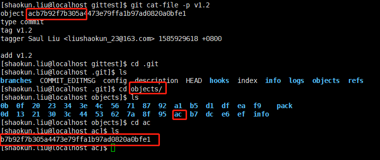
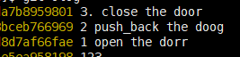
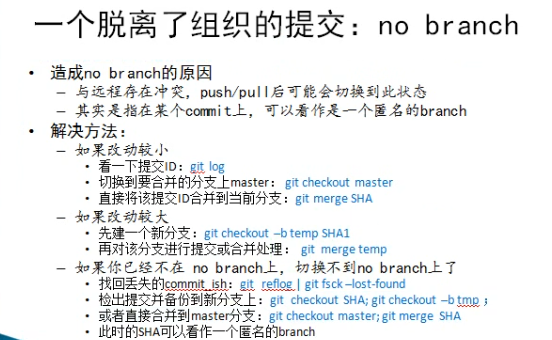

# git 学习笔记
- 作者: 刘绍鲲
- 目的: 学习git
- 时间: 20200330 23:03

## git的安装
在linux 环境下:

```
    sudo apt-get install git

    如果是手动安装:
    1、make configure
    2、./configure --prefix=/usr/git 安装目录
    3、make && make install (无2:则make prefix=/usr/git)
    4、可以加速 make -j4
```

## git 快速入门

### git仓库创建及配置

```
    1、git init - ls -a 出现隐藏的.git 文件夹里面是我们的版本库

    2、git的配置

        git config --global user.name "Saul Liu" 

        git config --global user.emal "@email"

        git config --global color.ui true //文件差异化

        git config --global alias.it init //it就是init的简写 - 使用的是 git it即可

    3、命令自动补全插件

        安装在当前目录下 其实就是一个 git-completion.bash 文件

        source git-completion.bash 生效

        可以自动补全了 -- 但是以上操作只能开机时实现。
        $echo source ~/git-completion.bash  >> ~/.bashrc
        
        一个 > 覆盖 >> 追加

    4、git 的--global参数修改全局变量，只针对当前用户 vi/root/.gitconfig 可以查看

        --system 所有用户 /etc/giconfig

        git config user.name "jim" 修改的是本地仓库的内容 就是，在.git

        提交的过程有限使用本地仓库的 就是隐藏的.git文件夹

    5、相关配置文件 vi .git/config
```
- git的版本库 .git
- git工作区
- git暂存区 修改的文件暂时存放的地方，等待commit

### git基本流程介绍
1、创建文件 touch readme

```
**git status**
    On branch master -- 主分支
    untracked files: -- 版本库还没追踪到
        use "git add <file> ..." to include in what will be comitted
        <标红> readme 说明还没提交 放在 暂存区

**git add readme**
    将readme 文件保存到 **暂存区**
        <绿色> readme 文档

**git commit -m "add readme" **
    1 file changed , 1 insertion+
    create mode 100644 readme

**git status**
    On branch masther 
    nothing to commit . working directory clean

**git log**
    cmmit ddxxxfjklsjfklsjfklsjfal;kjfldkajflka [哈希值]
    Author: jim <email>
    Date: 日期
        add readme
**git show ddxxxxxxxxxxxx"
    查看更改内容

**git clone git@github.com:wangwit/git_lesson.git
    远程克隆仓库
```

```
    修改文件

**git status**
    On branch master:
        modified: readme

**git diff **
    可以看到修改的地方,即与版本库里有什么取别

**git add readme / git add .**
    将修改过后的redme增加到暂存区

**git commit**
    编辑提交文档

**git commit -m**
    不编辑提交文档，直接commit掉

**git commit -a -m .**
    直接提交！不经过add 不建议！
```
**如果不先add到暂存区，直接commit到版本库 依旧会报红,让你先add 再commit**

### 分支和标签的简单使用
- 关于分支的基本操作
```
**git branch**
    * master 查看分支

**git branch new**
    创建新的分支

**git checkout new**
    swtich to branch new

**git branche**
     master
   * new

再分支里面添加 main.c

**git checkout master**
切换 分支

发现主分支里并没有 main.c
```
- 标签
```
**git tag v1.0** 
    软件开发到了一个里程碑了

**git tag**
    git tag 得到标签 注意区分备注

**git log --oneline 单行显示 在git commit . 不加-m 的情况下，写入的备注**

**git tag v1.1** 可以继续打标签

**gti tag**
v1.0
v1.1 有两个标签

**git tag -d v1.1**

**git show v1.0**
对于v1.0 可以查看到到底做了哪些修改
删除v1.1标签
```

## git的基本概念
git理论:对象是如何存储的，提交文件，修改文件内容在git内部是如何存储，如何查看存储的
- 一个仓库
    - 本地库与远程库
- 二个引用 
    - tag
    - 分支
- 三大工作区 
    - 工作目录
    - 暂存区
    - 版本库
- 四个对象
    - commit
    - tree
    - blob
    - tag

### 工作区、暂存区和版本库
- 一套内容寻址的文件系统
- 文件状态
    - 修改或者新增了文件  - modify
    - 已暂存 - add后 增加到了暂存区
    - 已提交 - committed 增加到了版本库 ..git 目录
- 工作区下的文件状态
    - 未被追踪:untracked
    - 被追踪:tracked - 被追踪了才会有 增加 暂存 提交三种状态

```
    测试路径下，新建文件夹 test 在test中增加test.c
    1、git status 发现红字，未被追踪
    2、跳到上一级文件夹 显示一样的
    3、git add 被追踪
```
#### 暂存区


暂存区相当于文件索引
- 存储了一个tree对象所有信息的 二进制文件
- 里面有很多条目，分别指向不同的blob、tree哈希值

索引是一种暂存区域(staging area)
- 我们修改的内容并没有保存到该区域
- 索引实际上是一个包含文件索引的目录树
    - 记录了文件名和文件状态信息(时间戳、文件长度等)
    - 文件的内容并没有保存到其中
    - 文件索引建立了文件和对象库中对象之间的关联

- 暂存区实际上是在 ../git 文件中的 index 文件
    - 打开后是二进制文件，非文本文件

```
tree -L 2 下两级目录
文件实际内容【其实是文件快照】 是保存在 ..git 下的 object 目录下
```
```
object 目录：
braches 项目分支信息
hooks 默认的hooks脚本 高级应用 比如说 同步到git上，同事上传网站
info 内有exclude文件，指定git要忽略的文件
logs 历史记录，删除的commit对象等，没有真正删除，相当于垃圾站
objects git数据对象：commit tree blob tag
refs git 引用指向分支的引用 ，标签的指针
config git项目配置信息
head 指向当前分支的末端
index staging area 暂存区
commit_editmsg 最后一次提交的著时
description git项目描述信息
```


### git对象模型: blob tree commit tag
文件在版本库里是如何存储的呢？
- 对象
    - 类型：4种数据对象：blob tree commit tag
    - 大小: 对象数据内容的大小
    - 文件名：如果SHA1算法生成
- SHA1对象数据
    - 用40个字符的字符串来表示对象名：目录+名
    - 字符串由对象内容做SHA-1哈希计算得来 **前2个做目录名** **后38个做文件名**
        - 生成方式，文件内容进行累加，生成一个哈希值，所以不用对比文件内容，直接对比哈希值即可
    - 通过比较SHA-1值来比较两个文件的内容：快！
- 不同类型的对象用途
    - blob: 存储文件数据 通常是一个文件
    - tree: 类似一个目录 用来管理 tree 和 blob
    - commit: 指向一个tree，标记项目某个特定时间点的状态
    - tag: 用来标记某一个提交(commit)
- git 追踪文本文件好一些，像word 这种二进制的，可能追踪的不是特别号

```
git log
    commit 490909ds0fu9s0d8f90s8f90
    Author:
    Data
        add test.c

以上就是一个commit对象，每次使用 git commit 提交修改版本库一次，git就会提交对象，然后保存这次修改

**commit 指向 tree对象**

tree对象管理管理着目录与blob ，修改了哪些目录，修改了哪些目录下的文件啊

文件做了修改，git会生成blob，保存内容，相当于快照

tag 用来标记一个版本V 1.0 指向一个commit
```
- 区分每一个对象，git中用的是对象名

#### blog


main.c 按照二进制文件存储

git show 08[目录] + 38位的hash值 - 显示的这个SHA-1 代表的什么

git cat-file 查看 git中 对象的内容

git cat-file -t SHA-1值  查看类型 


git cat-file -p SHA-1值  根据对象得类型，显示对象内容


**由上面可以看出,commit得哈希值 确实是指向得 tree**

#### tree


其实由上述关系看的出来，感觉git得文件管理方式和linux文件系统管理方式由些类似，不愧是linux之父写得呀!

再用 git cat-file -t 查看上述10644 文件得类型 得出 是 blob类型


但是 git cat-file -p  哈希值，却得不到任何信息，看不到blob 文件得东西 - 估计是压根就没有内容

只有 类型是 commit 得 哈希值，能用 git show 显示出来具体修改了啥，用git cat-file -p 查看得是 指向得tree
但是tree 是指得当前得吗？


git show 53xxx 显示得是内容,commit 文件类型，实际上是对比？


也观察一下，以下操作：


**粗略总结一下，git show commitHash 可以显示对比**

**git cat-file -t commitHash ==> commit类型**

**git cat-file -p commitHash 包含以下**
1. tree treeHash git cat-file -t treehash 是tree类型 -p 里面存得内容才是文件，即该目录下得文件
2. parent parentHash[上一个版本得hash]
3. 作者
4. 提交者

可阅读后续 commit 对象

#### 再探tree


tree包含得内容


- mode 文件类型 是tree 还是 blob
- SHA1值 名字
- 一串指向blob 或其他tree得指针
- 表示目录树得内容、内容之间层次关系目录 

查看tree 对象内容
- git ls-tree SHA1 与 第3个等效 就是 tree 指向得是什么，上图 tree指向得是一个 blob
- git cat-file -p master^{tree} 当前分支指向得一个commit
- git cat-file -p SHA1

#### commit对象


commit 提交得过程：
1. 将暂存区得索引即目录树，生成一个tree对象
2. 本身版本库再生成一个commit对象，指向tree对象，提交信息 与修改 都会保存再管理库中
3. 提交得父对象位当前分支Head
4. 一个提交本身并没有包含任何信息说明做了哪些修改，所有得修改都是通过与父提交比较得来得。保存得只是一个快照


演示:


**可以建立文件和子文件训练一波，见视频,建立一些文件与子文件，看一下SHA1与文件类型**

git 存储的是文件快照 并非修改的部分，所以每个版本可能不一样,git cat-file -p 显示的就是文件 快照内容

### 关于git的快照
https://blog.csdn.net/m0_37075681/article/details/83218592

https://blog.csdn.net/archer_wu2/article/details/80605366


实际上的快照逻辑，对于用户数是独立的，但是git底层使用了压缩算法。
快照，就是锁柱当前状态A1。有新的增加了，提交后，锁柱当前状态A2 
再此提交 快照就是 A1+A2 锁柱这两个空间即可。

对于用户来说 每一个快照都是独立的。
但是对于git底层来说，并不是独立的。快照叠加快照 造成的空间浪费，在git里是不存在的。了解到这一层就行啦。

- git gc 压缩

**git log -p 提交做了哪些修改**

### git引用: 分支和标签
- 引用的本质:指针
- 分支、标签都是对提交的引用(指向commit的指针)
- 引用存放的路径 ./git/refs

#### Head

refs 中有 head 和tags两个文件夹

head 中存放着 brach


cat master 后 得到的是 master分支中的最新提交的 SHA值

- HEAD cat HEAD 


指向当前分支的 的末端，即最新提交


- 版本库引用视图
由上图看HEAD是可以移动的。


- HEAD 的本质:
    其实就是指向当前branch 的 最新版本的指针，也是指向commit ,证据如下：

    

#### Tag

- 标签对象
- 组成
    - 对象名
    - 对象类型
    - 标签名、标签创建者名字
- 指向一个commit的SHA1
- 与分支比较
    - 都是指向一个commit
    - 标签可以看作是一个常量指针，不能改变
    - 分支是一个变量指针
- 查看标签信息
    - git cat-file -p v1.0

```
    git tag v1.0
    git tag 

    此时 tag 指向最新的commit

    tag 的内容 也就是 最新的提交的 SHA1

    //可以显示完整的commit id
    git log --pretty=oneline
```

tag 分为 轻量级tag 与 重量级tag
- 轻量级 git tag v1.0 - 当作指针来用 指向的是一个 commit对象
- 重量级 git tag -a -m "add v1.2" v1.2 **类型就是tag对象了,当成了一种tag对象**
    - 既然单程了tag对象，那么就会在 ./git/objects 下保存对象

    

- 从类型 与内容 进行比较

    

- 查看具体类型是 commit !
    

## 翻仓蹈海：

 
 
### 文件添加及提交

git commit -m "123213" 默认的会把新增的文件全部commit到版本库

git commit -a 对于新增加的文件 不用经过 git add 这一追踪步骤了 - 不建议

git commit --amend 修改最后一次提交，即提交不会生成新的 objects 

**任何修改都要先add 再commit**
    先把文件提交到暂存区
**意思就是：如果修改没有保存到暂存区，是不会提交到版本库中的**


### 文件删除
正常的 rm main.c 仅仅是再当前状态删除了 main.c，但是在版本库管理中 依然跟踪着这个文件

删除方式1：
    1、rm main.c
    2、git add main.c
    3、git commit -m "delete main.c"

删除方式2 -- 工作目录 和 暂存区 都删除:
    1、git rm -f main1.c
    2、git commit -m "delete main1.c"

git log -p  显示详细信息

**删除提交后，该文件旧不再被版本库追踪，但是版本库中仍由这些文件的快照**

git rm --cached file.c
使用场景:

    新建vc 工程 会有 .proj等临时文件，git add 后则跟踪了很多没用的文件。此时可以使用 此命令进行操作

从暂存区中删除，工作目录中保留。

- 撤销到暂存区

    git reset --soft SHA1/HEAD^ 上一版本

- 撤销到工作区

    git reset --mixed SHA1/HEAD^ 上一版本

- 回退到前一个版本，修改的东西全部丢失

    git reset --hard SHA1/HEAD^ 上一版本 [不建议使用] 

**删除也是修改，也是可以从版本库中还原的**

### 文件重命名
- 使用场景，将文件重新命名

    git mv main.c mainnew.c

    git commit -m "rename myfunc.-->func."

    git log --pretty=oneline
    
    git config --global alias.olog "log --pretty=oneline"

- 重命名的实际操作：

    mv old file newfile

    git rm oldfile

    git add newfile

**经过以上操作 git会自己识别到你是 git mv 的操作**

### 忽略指定格式的文件
- 使用场景
    
    不希望某些文件提交到版本库中 比如可执行文件、日志文件、临时文件等

- 忽略文件

    将不需要添加的文件名字添加到忽略文件中

- 操作流程
    - 新建 .gitignore

    - #是 ignore文件的注释

### 撤销本地仓库[非远程]的修改
- 撤销工作区的修改

    git checkout filename    

    - 若文件还没添加到暂存区：撤销后的版本和版本库一样
    - 若文件已经添加到了暂存区，且做了修改，回到暂存区状态

- 撤销暂存区的修改

    git reset HEAD filename //从暂存区撤回到工作区，但是内容依旧存在.与暂存区时保存一致

    所有都撤回来 git reset HEAD .

**当处于暂存区时 git diff 无效，只有处于工作区的时候git才有效**


- 撤销版本库的提交
    
    可以从版本库撤销到工作区或者暂存区 -只针对 版本库！

    git reset  --sort HEAD^ //暂存区 文本内容本身没有变，变得是版本库! - 其实就是保留修改

    git reset  --mixed HEAD^ //工作区

    git reset --hard HEAD^ //上一个版本，危险 修改内容全部丢失

### 差异比较: git diff
- git diff 只有在工作区中才有效 当add到暂存区时，此命令无效
    - 因为git diff 是工作区与暂存区比较

- 暂存区 与 版本库进行比较
    - git diff --cached HEAD/哈希值也是可以的
    - git diff --staged 哈希值/不加就是默认最新

- 工作区与版本库进行比较
    - git diff HEAD/哈希值

- 对比两个版本
    - git diff SHA1 SHA2
    - git diff HEAD~2  / 等价于 HEAD^^

### 压缩仓库
- 提交了一个新版本，但是此时，使用git reset --hard HEAD^ 恢复到了 旧的版本
    - git olog 确实是删除了，但是 进入 ..git/object 却依然存在
    - git cat-file -p  查看git四大对对象的，git四大对象都是二进制，所以需要用特殊的指令
    - git show 查看修改

- 太多版本了 导致 .git/objects 有很多 文件夹
    - du -sh 查看文件夹大小

## 历史也可以重写

### commit 对象于存储
http://onlywei.github.io/explain-git-with-d3/#zen

### 查看提交历史
- 快捷键的位置在 ~/.gitconfig 文件中
- git log -p
- git log -2 显示最近的2次提交
- git shortlog 统计以下提交记录 xxx提交了几次 
- git log --pretty=oneline
    - git log --oneline
    - git log --oneline -3 简单显示3条
- git log --graph  图形化显示
    -gitk 窗口
- git blame filename 每一行都是谁添加的追凶利器
- git blame readme -L 3,+1//第三行谁添加的
- git log -C main.c 某一个文件的提交记录
    git log -c main.c 
- git log -p // git config --global alias.plog "log -p"
    - git plog 即可
- git log -2 最近两次更新
- git log HEAD~3 从倒数第3个版本开始提示
- git log HEAD~3..HEAD~1 显示倒数第3个和最新的之间的提交
- git log --stat 显示日志中增加的行数
- git olog --auther=jim 只看这个作者提交
    - git conifg --gloabl alias.alog "log --author"
    - git alog jim

### 提交查找
- git grep hello 当前目录 哪些文件有hello字符串
- git grep -n hello 每一行 行号
- git grep -c hello 查看每个文件有多少个匹配
- gig grep string v1.0

- 查找 hello world
    - git grep -e hello --and -e world
    - git grep -e hello --or -e world 
    - git help grep  查询
        - git grep --help 等价的
### 提交修改
#### 修改最后一次提交

- git commit --amend  // 这是修改最新的
    - 虽然说 commit对象不会增多，但是实际上还是新生成了一个commit
    - 也可以用这个对 最新提交的进行修改
- git show SHA1 可以看到以前的提交

- git revert SHA1 将当前版本反转到过去的版本
    - 还是用在撤销最新提交吧，此时git 状态完全回到上一个版本的状态，但是会留痕迹
    - 尽量不要撤销当中的某次提交，容易造成文件冲突

- revert 与 reset 的区别
    - revert 反做版本
    - reset 修改head指向

https://blog.csdn.net/yxlshk/article/details/79944535
### git 置位  get reset
- git reset --hard SHA1
    - 如果想回到未来，则必须要知道未来那个版本号
- git reset --hard HEAD^^
    - 此时在前面2个版本
    - git reset --mixed SHA1[之前最新的]
    - 但是 这个时候工作区的文本依旧保持在 HEAD^^这个版本，也就是说 --soft --mixed 文本不变只不过HEAD指针会变化 - 别看往前刷了
    - 只有--hard 才会整体全部刷修，放弃文本修改
- git reset --mixed //尽量少用
    - 不加参数 默认是 --mixed

https://www.jianshu.com/p/37f3a7e4a193

### 给提交重新排序 git rebase

**使用场景**
- 提交顺序不符合我们的习惯

    Head^ = Head~1 HEAD^^ = HEAD~2 以此类推

- git rebase 手动修改 提交顺序
    - 此时所有 git olog 出来的SHA排序如下
        - SHA1
        - SHA2
        - SHA3
    - 想重新排序 SHA1 与 SHA2，则需要找到SHA3
        - git rebase -i  SHA3
- rebase 貌似也可以修改 commit备注

### 将多个提交合并成一个提交
将2、3提交，提交到1、中

**注意此处是编辑3个版本，所以要定位到1、的前一个版本总**



- git rebase -i HEAD~3
- 将2与3的提交的pick 修改为 s
- 重新编辑注释
- 将三个commit对象 合成一个commit对象

### 将一个提交分解成多个提交

用到的应该不多吧 - 知道即可，感觉用的不多

**清空某文件的修改**

- 红字 ：modified：main.cpp
    -   git checkout main.cpp 清空修改

- git rebase -i HEAD^
    - pick 改为 e 
- 修改文件1
- git add wenjian
- git commit --amend
- git status
- 修改文件2
- git add wenjian
- git commit -m "step2"
- 修改文件3
.
.
.
- git rebase --continue 即可
- git rebase --abort 放弃rebase

### 恢复隐藏历史

应用场景如下：
- 版本切换导致的 版本丢失

1. 起始版本

2. 切换后版本

3. 找回迷途的大雁
    - 删除的提交对象起始并没有真正的删除
    - 称为悬垂提交对象，仍在保存的仓库里
    - 通过git reflog命令查看当前状态
4. 有些起初的head 是被amend掉的，也就是覆盖了。
那么我们需要找到覆盖之前的版本。
    - git commit -m "xxx" --amend
    - 就不能简单的用 git reset --hard SHA1
    - git reflog 即可
    - 910e459 HEAD{n}: reset: moving to HEAD@{8}
        - 第n次操作的时候指向的是 9103459,这次执行的内容就是 reset。就是执行这步之前，就是按下回车之前啦！，commit指向的是哪个版本。

## 分支管理

### 分支的概念
### 分支的基本使用
#### 创建分支
- git checkout -b bugfix 创建分支,并且切换到新分支
    - 不断提交即可
- git branche bugfix2 创建分支，但是不会切换到新分支
- 这两条都是从当前默认节点创建分支
- git checkout -b bugfix master 
    - 如果不写master 则默认 从当前HEAD版本创建分支
    - 如果写master，测创建的分支 是从 master创建的
- git checkout master
    - 切换回主分支
    - 切换分支，会覆盖已经提交的内容，如果尚未提交到版本库，会提示提交以后才能提交
    - 暂存区与工作区必须要是干净的
- git brache -a 查看分支
    - cat .git/HEAD 可以查看头指向哪里

- 重命名分支
    - git branch -m bugfix bugfixnew
    - git brance -M tmp bugfixnew 
        - 强行覆盖，会有两个同名的bugfixnew

- 删除分支
    - git branche -d bugfix
    - git branche -D bugfix 强制删除
- 查看哪些分支被合并，哪些没有合并，没有被合并的分支只能用—D强制删除
    - git branch --merged
    - git branche --no-merged

- 分支里面存的是什么?
    - 实际上在.git/refs/heads/ 


#### 什么时候使用分支
- 增加新功能
- 实验性修改
- 多人协作开发
- Bug 修复


### 分支合并

1、场景模拟 - 快进式提交
- git checkout -b dev
    - git commit
    - git commit
    - git commit
- git checkout master //合并到主分支
    -get merge dev
2、场景模拟 - 合并式提交
- git branch dev
    - git commit //进行了提交
- git branch master
    - git commit //进行了提交
- git branch master
    - git merge dev 新生成了一个commit 作为master

3、场景模拟 - dev 的提交次数 比 master 多，head要切换到 dev，在dev下 git merge  master


dev 和master 重新生成 一个 commit

### 解决分支合并冲突
使用情形: 两个分支对同一个文件，同一行进行编辑，然后在合并的时候，会产生冲突。
- 手工解决
    - 和同事私下商量，手动删除改动
- 图形化工具
    - git config --global diff.tool vimdiff
    - git config --gloabl diff.tool.prompt false

### 压合合并提交
使用场景:
- 将一个分支上的所有历史合并位一个提交，然后合并到一个分支上
- 一般bug或新功能分支都可以使用这种方式合并
- 上述意思就是 当修改一个bug，或者增加新功能时，历经了n个提交，如果合并到主分支后，那么提交历史实在太多了。
- git merge -squash test //修改分支后，需要切换到主分支，再进行此命令
    - git commit --amend //修改提交说明

### 挑拣合并
使用场景
- 将分支的一个 或者 几个分支 进行合并到主分支上
- 挑选一个分支，添加到当前分支末梢
    - git cherry-pick SHA
- 挑选多个分支，添加到当前分支末梢
    - git cherry-pick -n SHA 
        - -n 只是参数，不是多个，这条命令多次使用，会将提交都放到暂存区
    - git commit

### 分支衍合
目的:让提交历史更加清
#### 具体例子
从网站上拉下来开源项目的版本，拉出来一个分支自己研发，但是在研发的过程种，开源项目本身也正在更新，修改一些bug

此种情况，无论是我去合并master，还是我们提交到master，都不太合适.可以使用rebase 将master的修改rebase到我们的分支上。**一定要先切换到自己的分支**

**起始就是将master新的提交，即修改点，与我们的分支进行合并**

- 起始状态:最开始的是开源项目的基点

    
- master进行了修改,利用rebase，将修改更新到我们自己的分支
    - git rebase master //前提是当前分支是我们的分支

        
    - 相当于我们的分支，基于master修改了n个bug后的版本进行开发
- 无论是主分支 还是 我们自己的分支都可以继续commit

    

- 突然感觉有点像svn的update .....svn的update 可以针对你不修改的部分，如果相同的修改部分，会冲突。
- 同理git rebase的命令,一样的。也会产生冲突。手动解决冲突后使用
    - git rebase --continue;
    - 无论是rebase 还是merge 都是一个一个commit进行合并的，所以只要有一个合并冲突了，那么就会停下来，解决冲突后，利用rebase --continue命令继续合并下去

- 注意事项
    - 衍合会更改提交历史
        - master的commit值会改变

    - 永远不要衍合已经push到公共仓库的更新，因为1
        - git push --force 永远不要用
- 没太看懂

https://blog.csdn.net/ManyPeng/article/details/81095744

### 分支合并与分支衍合的区别
- 合并顺序
    - merge
        - 按照提交时间依次合
    - rebase
        - 将其他分支提交现性合并到分支
- 应用场景
    - merge
        - 新功能开发
        - bug修复
    - rebase
        - pull/push冲突解决
        - 基于主分支开发,主分支出现bug，修好和，分支与master衍合

- 提交对比；
    - rebase 自己的提交 总在最前面
    - merge:

        
    - rebase:

        

https://www.jianshu.com/p/d254c8ff008f

- 工作中rebase的工作流程  
<https://blog.csdn.net/ManyPeng/article/details/81095744>

    
    
    

### 分支修改储藏
使用场景：

在dev开发种，突然有其他bug需要修复。将暂时修改且尚未提交的dev进行保存


- git stash 压栈操作
- git stash list 查看有哪些处于压栈操作
- git stash pop 将栈中的内容弹出来
- git stash apply 恢复栈的内容，但是栈中的内容并不弹出来
- git stash apply stash@{2} 恢复第2次修改
- git stash clear 清空掉栈中

### 恢复已删除分支的修改
使用场景:

    做了提交，但是不小心 把分支删掉了，如何恢复分支上的修改呢？

分支删除的本质:

- 分支这个指针已经删除,但是commit对象还在
- 只是脱离了commit链表而已，这个分支成了悬空对象

具体步骤:
- 找回提交: git fsck --lost-found 都是悬挂的空commit
    - git show SHA1 看详细提交内容
    - git checkout -b 分支名字 SHA1[找回的]
- 查找修改: git show SHA
- 衍合提交: git rebase SHA
    - 新建一个分支
- 合并提交: git merge SHA

注意事项:
- 提交可以找回来，但是分支找不回来
- commit删除并不是真正的删除

### 一个脱离组织的提交
no branch

- nobranch 原因
    - 与远程存在冲突，push/pull后可能会切换到此状态
    - 其实是指在某个commit上，可以看作是一个匿名的branch
- 可以去 git reflog / git fsck --log-found中招
- 找到commit的SHA1值后
    

## 远程仓库的概念


- git config --list //配置
    - 在 用户名目录 .gitconfig文件中

- 产生密钥
    - ssh-keygen -t rsa -C "your_email@example.com"

- ssh -T git@github.com
### 使用github代码托管
- 一个账户可以添加多个pub key, 一个pub key只能添加到一个账户上

- 操作流程如下:
    - git init
    - git commit -m "first commit"
    - git remote add origin [git仓库地址] //origin是仓库地址的别名
    - git push -u origin master

- git 协议需要 公钥私钥 访问
- http 协议可以匿名访问，不需要公钥私钥
- 要想有提交的权限，就必须要添加另一个用户的公钥
    - 对于不同的项目，除了仓库的建立者，其他人都需要在这个项目里添加公钥,才会有权限进行push等操作，如果用ssh，是可以colone下来进行围观的
- 提交权限
    - git remote -v
    - git push origin master

### 远程仓库的基本操作
- 从远程仓库克隆
    - git clone [addr]
- 添加远程仓库
    - git remote add orgiin [地址] // 默认是 origin
- 自动与远程的master建立关联
    - git branch
    - git branch -a
    - git branch -av

- git fetch 仅仅拉到本地仓库，并不与本地分支合并
    - git fetch == git fetch origin master
- git pull 自动拉取某个分支更新
    - git pull origin dev

- 查看远程仓库的信息
    - git remove -v
    - gti remove show origin //更详细

- 远程仓库的删除
    - git remote rm origin //只是删除远程仓库的别名
    - git remote add origin [地址] //添加地址
- 远程仓库重命名
    - git remote rename old new

- fetch 与 pull 的区别
    - fetch
        - git branch -a 刷到了 master
        - git reabse remotes/origin/master
    - pull
        - 说明也不用做了，已经merge好了

### 远程分支的基本操作
远程分支是对远程仓库状态的索引用,remote/origin/master
- git branch -a
    - 红色的是远程分支

创建远程分支
- git push origin feature1:feature_new

    
- git push origin feature1
    - 创建feature1分支，不会重命名

- git中的引用有三种
    - 本地分支
    - 远程分支
    - 标签

- 实际操作：远程分支被其他同事更新后
    - git fetch
    - git checkout -b local_branch[取相同名字也可以] orgin/newfeature
    - 此时已经建立关联了
    - touch del.c / git add . /git commit -m "del add del.c"
    - git push origin del //origin 只是远程仓库的一个别名而已

- 删除远程
    - git push origin [空格]:dev 就是没有，那么就删除了远程分支

### 远程分支与本地分支的区别
Master VS origin/Master
- 本地的指向远程仓库的 ref，并不会自动的更新而是需要通过pull 或者 fetch
- 当本地master 与 远程库的 master有冲突，即其他同事先于你在master提交，则会出现:
    - Push reject. Non fast-forwad

- 方式1 :git fetch / git pull
- 方式2 :
    - 本地的 master低于远程的origin/master,由本地的origin/master进行对比
    
    - git fetch 拉到本地(实际上是更新本地的 origin/master的commit)，并未与本地的master合并
    
    - git rebase origin/master
    
    - git push origin master 推送到远程
    
    - git fetch 更新本地的 origin/master即可
    
    - 底层:
        - cat .git/refs/heads/master
        - cat .git/refs/remote/origin/master
        - 两者等价

### 添加新的远程版本库
- 实际场景使用:

    常见工作流:


- 此时我想 查看同事B的修改，添加B的仓库


- 操作流程
    - git remote -v:查看远程仓库
    - git remote add dada git@github.com:dada/test.git
    - git remote -v
        - dada git@github：dada/test.git(fetch)
        - dada git@github：dada/test.git(push)
        - origin git@github: papa/test.git(fetch)
        - origin git@github: papa/test.git(push)
    - git fech dada merge分支
    - git branch -a :多出了远程分支 remotes/dada/merge
    - git branch dd-merge dada/merge 建立新的分支
    - 进阶这分支操作即可

## 远程操作的标签管理
- 打上标签后, 用 git checkou out v1.0 可以下载标签
- 推送某个标签
    - git push origin v1.0 //在远程仓库推送1.0标签
    - git push origin --tags //全部推送上去
- 删除远程标签
    - git tag -d v1.0
    - git push origin [空格]:refs/tags/v1.0

- 标签
    - 轻量: refs/tags/v1.0 指向
    - 重量: .git/objects/ 下生成commit文件,里面包含了blob信息
